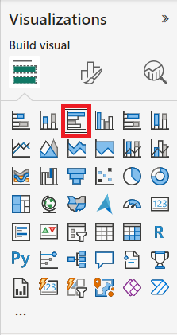

---
lab:
    title: 'Create Visual Calculations in Power BI Desktop'
    module: 'Create Visual Calculations in Power BI Desktop'
---

# Create Visual Calculations in Power BI Desktop

## **Lab story**

In this lab, you'll create visual calculations using Data Analysis Expressions (DAX). 

In this lab you learn how to:

- Create and edit visual calculations
- Use the CALCULATE() function to manipulate filter context
- Use Time Intelligence functions

**This lab should take approximately 45 minutes.**

## Get started

To complete this exercise, first open a web browser and enter the following URL to download the zip folder:

`https://github.com/MicrosoftLearning/PL-300-Microsoft-Power-BI-Data-Analyst/raw/Main/Allfiles/Labs/xx-create-visual-calculations-in-power-bi-desktop/xx-visual-calculations.zip`

Extract the folder to the **C:\Users\Student\Downloads\xx-visual-calculations** folder.

Open the **xx-Starter-Sales Analysis.pbix** file.

> ***Note**: You can dismiss the sign-in by selecting **Cancel**. Close any other informational windows. Select **Apply Later**, if prompted to apply changes.*

In Power BI Desktop, go to **File > Options and Settings > Options > Preview features**. Select **Visual calculations** and select **OK**. Visual calculations are enabled after Power BI Desktop is restarted.

## Create a visual

In this task, you’ll create a bar chart showing sales amount and total product cost by fiscal year.

1. In the **Visualizations** pane, select the clustered bar chart visual type.

   

1. In the **Data** pane, from inside the **Date** table, drag the **Year** field into the **Y-axis** well/area. 

1. Drag the **Sales** and **Cost** fields from the **Sales** table into the **X-axis** well/area. 

1. Sort the resulting bar chart by **Year** ascending by using the three-dot menu and selecting **Year** followed by **Sort ascending**:

   

## Add calculations

1. With the bar chart selected, select **New visual calculation** in the ribbon:

   

1. The visual calculations edit window opens. In the formula bar above the visual matrix enter the following expression:

   ```DAX
    Profit = [Sum of Sales] – [Sum of Cost]
   ```

1. Confirm you now see a Profit column on the visual matrix at the bottom of the screen:

   

1. Expand the menu under **New visual calculation** and select **Versus previous** from the template options:

   

1. In the formula bar, replace the `[Field]` placeholder with `[Profit]` twice and commit the calculation.

1. Select **Running sum** from the templates menu and replace the `[Field]` placeholder with `[Profit]` and commit the calculation.

1. Select **Moving average** from the templates menu and replace the `[Field]` placeholder with `[Profit]` and the `WindowSize` placeholder with 2. You should now have the following set up:

   

## Hide fields and finish visual

